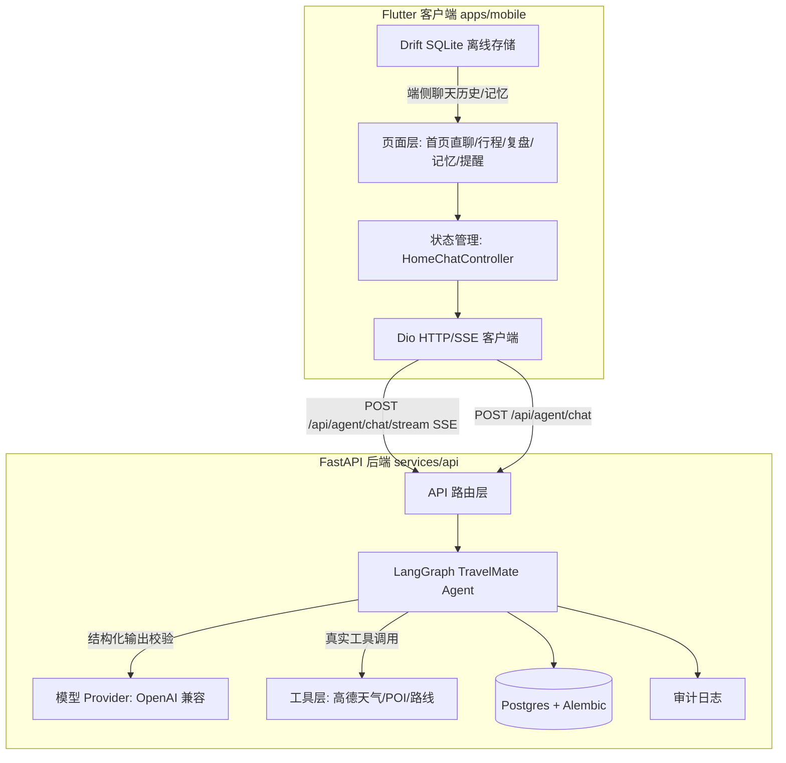

```mermaid
graph LR
    subgraph "Full 模式 (完整规划)"
        N1[input_normalizer] --> N2[context_loader]
        N2 --> N3[intent_router]
        N3 --> N4[memory_extractor]
        N4 --> N5[memory_writer]
        N5 --> N6[profile_updater]
        N6 --> N7[trip_context_builder]
        N7 --> N8[tool_planner]
        N8 --> N9[tool_executor]
        N9 --> N10[trip_planner]
        N10 --> N11[trip_adjuster]
        N11 --> N12[reminder_checker]
        N12 --> N13[avatar_state_mapper]
        N13 --> N14[response_composer]
    end

    subgraph "Chat 模式 (轻量聊天)"
        C1[input_normalizer] --> C2[context_loader]
        C2 --> C3[intent_router]
        C3 --> C4[fast_chat_response]
    end

    subgraph "Plan 模式 (仅规划)"
        P1[input_normalizer] --> P2[context_loader]
        P2 --> P3[intent_router]
        P3 --> P4[trip_context_builder]
        P4 --> P5[tool_planner]
        P5 --> P6[tool_executor]
        P6 --> P7[trip_planner]
        P7 --> P8[trip_adjuster]
    end

    subgraph "Review 模式 (仅复盘)"
        R1[input_normalizer] --> R2[context_loader]
        R2 --> R3[intent_router]
        R3 --> R4[review_generator]
    end
```

# 架构设计

## 系统总览



## Agent 状态机

TravelMateGraph 是一个 LangGraph 显式状态机，由 19 个节点顺序串联组成。根据意图路由结果，可选择 4 种执行模式：



每个节点签名为 `def node(state: TravelMateState) -> TravelMateState`，通过 `_next_state(state, "node_name")` 不可变更新状态。`error_fallback` 作为兜底节点，确保任何异常都不会导致整个图崩溃。

## SSE 流式机制

`POST /api/agent/chat/stream` 基于 `LangGraph stream(stream_mode="updates")` 逐节点推送：

1. 每个节点完成后推送 `event: stage`，包含 `node` 和中文 `label`（如"查询实时天气与景点"）。
2. 全部节点完成后推送 `event: final`，包含完整 `AgentChatResponse` JSON。
3. 异常时推送 `event: error`。

客户端 `sendMessageStreaming` 解析 SSE 事件流，在打字指示器实时显示当前阶段；解析失败或服务不可用时自动降级到非流式 `POST /api/agent/chat`。

选择阶段级而非 token 级流式的原因：响应是结构化 JSON，需要整体校验 schema 后才能安全拆分为卡片、记忆候选等组件。阶段级进度已能消除 8-15 秒全链路等待的焦虑感。

## 状态结构

`TravelMateState` 是一个 `TypedDict`，承载整个对话轮次的全部中间状态：

- 输入：`message`、`session_id`、`user_id`、`context`（含 `recentMessages` 多轮上下文）
- 中间产物：`normalized_input`、`intent`、`memory_candidates`、`user_profile`、`trip_context`、`tool_plan`、`tool_trace`、`trip_plan`、`reminders`
- 输出：`response`（含 `replyText`、`avatarState`、`emotion`、`cards`、`memoryCandidates`、`toolTrace`、`nextActions`、`syncSuggestions`）
- 审计：`model_call_logs`、`visited_nodes`

## 端云分工

| 职责 | 端侧 Flutter | 云端 FastAPI |
| --- | --- | --- |
| 聊天历史 | Drift SQLite 本地持久化 | 不存储会话历史 |
| 记忆胶囊 | 本地确认/编辑/删除 | 记忆候选生成 + 云端同步 |
| 行程规划 | 卡片展示 + 高德导航跳转 | LangGraph 规划 + 高德工具调用 |
| 用户画像 | 本地缓存 | 云端记忆聚合更新 |
| 模型调用 | 不直接调用 | OpenAI 兼容 Provider 结构化校验 |
| 审计日志 | 不涉及 | 脱敏日志落库 |

端侧不直接调用大模型 API，所有模型调用通过后端 Agent 统一管理，便于审计和降级控制。

## 降级策略

系统区分三类结果，通过 `provider` 和 `fallback` 字段显式标注：

1. **真实 Provider 结果**：模型或高德工具已配置密钥，返回结构化结果且 schema 校验通过，`fallback=false`。
2. **明确降级结果**：未配置密钥、HTTP 失败或 schema 无效，返回 `fallback=true` 并标注 `provider=unconfigured/mock` 和错误原因。
3. **本地聚合结果**：复盘、dashboard 等来自数据库的真实用户数据，不依赖外部服务。

客户端遇到 SSE 流式失败时自动降级到非流式接口；非流式失败时提供一键重试按钮。任何降级都不会用假数据冒充真实结果。

## 技术选型理由

- **LangGraph 显式状态机** vs LangChain Agent 自由循环：出行场景步骤有限且需要可解释性，显式状态机每个节点可独立测试和降级，延迟与成本可控。
- **阶段级 SSE** vs token 级流式：响应是结构化 JSON 需整体校验，阶段级进度已能消除等待焦虑，实现成本低。
- **Drift SQLite** vs 服务端会话存储：端侧持久化减少网络依赖，聊天历史随设备走，隐私可控；云端不存会话历史降低合规复杂度。
- **OpenAI 兼容 Provider** vs 锁定单一模型：通过统一接口适配蓝心/OpenAI 等多种模型，切换成本低。
- **Flutter** vs 原生：单代码库覆盖 Android，比赛期内交付效率最高；刻意不覆盖 iOS 以收敛范围。

## 目录结构

```
apps/mobile/          Flutter Android 客户端
  lib/
    features/         按功能划分: home/chat/trip/memory/review/reminder/settings
    core/             网络层、路由、主题
    shared/           共享组件: ChatBubble、TripPlanSummaryCard 等
  assets/             蓝小心立绘、开屏动画
services/api/         FastAPI 后端
  app/
    agents/travelmate/  LangGraph Agent: state/graph/nodes
    api/routes/         API 路由: agent/auth/audit/photo
    tools/              外部工具: 高德天气/POI/路线
    models/             SQLModel 数据模型
    db/                 数据库连接 + Alembic 迁移
  migrations/          Alembic 迁移脚本
infra/                 Docker Compose 编排
docs/                  工程文档
  engineering/         技术设计、API 契约、Agent 图、隐私合规
  handoff/             部署指南、交接状态
```

更多细节见 [docs/engineering/](docs/engineering/)。
