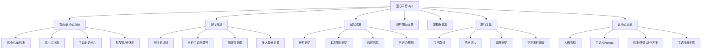
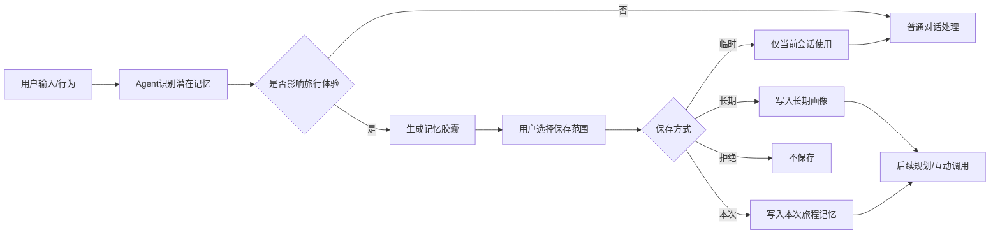
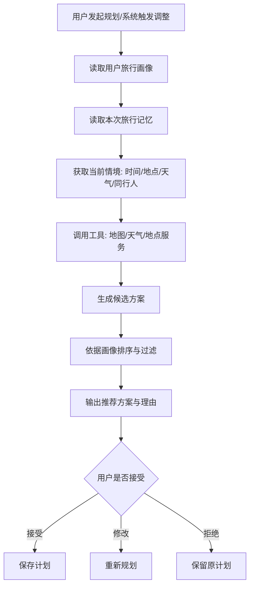
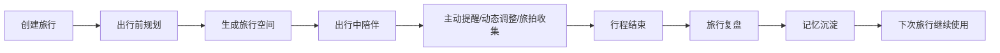
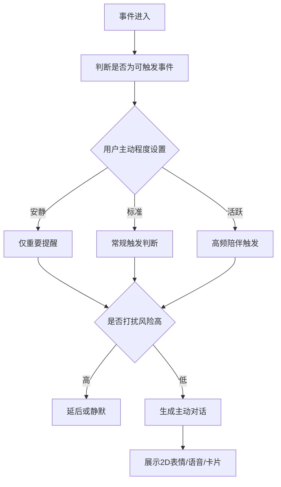
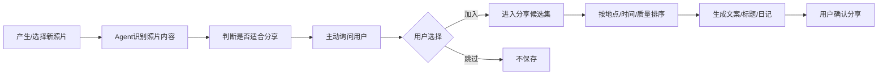
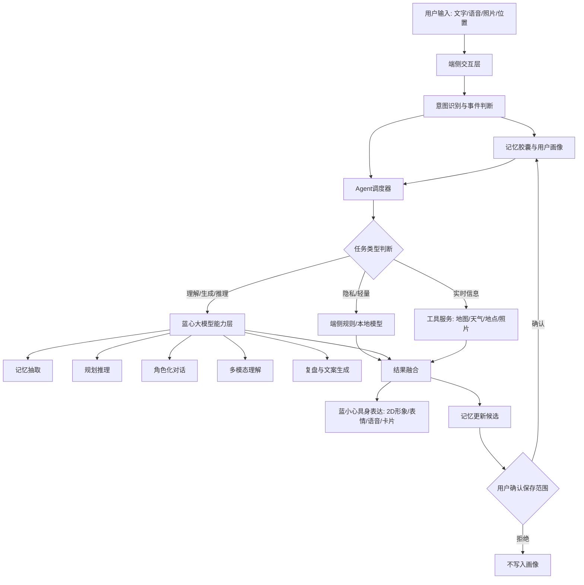

# 蓝心同行: 懂你的全旅程AI旅游搭子 产品需求文档 PRD

| 项目 | 内容 |
| ---- | ---- |
| 文档版本 | V0.2 |
| 产品名称 | 蓝心同行 |
| 2D数字搭子 | 蓝小心 |
| 产品副标题 | 懂你的全旅程AI旅游搭子 |
| 文档状态 | 初赛方案收敛版，待技术验证 |
| 创建日期 | 2026-04-28 |
| 适用场景 | 第三届（2026）AIGC创新赛应用赛道、后续MVP开发 |
| 产品阶段 | 0 → 1 新产品方案 |
| 备注 | 本PRD优先抽象产品能力，不提前绑定Live2D、后台照片监听、自动发布等具体实现方式，便于后续根据可行性验证灵活落地。 |

---

## 1. 产品概述

### 1.1 产品定位

蓝心同行是一款面向移动终端出行场景的具身化旅行Agent。它不是传统“攻略生成器”，而是一个拥有可控长期记忆、主动情境感知、AIGC 2D数字搭子和全旅程陪伴能力的AI旅行伙伴。

用户在产品中会遇到自己的2D数字搭子“蓝小心”。蓝小心通过“记忆胶囊”机制让用户自主决定哪些旅行偏好被记住，并逐渐沉淀为“用户旅行画像”。在出行前、出行中、出行后，蓝小心会基于用户画像、当前情境和外部工具能力，为用户提供个性化规划、主动提醒、旅途互动、旅拍整理和旅行复盘。

蓝心同行的核心不是让AI一次性生成攻略，而是让用户可控地培养一个越旅行越懂自己的AI搭子。蓝小心既是大模型能力的交互入口，也是人格、情绪、状态和陪伴反馈的具身化表达层。

### 1.2 一句话介绍

一个会记住你、主动陪你玩，还能以AIGC 2D形象陪你走完整段旅程的AI旅行搭子。

### 1.3 核心价值主张

| 价值点         | 说明                                                         |
| -------------- | ------------------------------------------------------------ |
| 越旅行越懂你   | 通过记忆胶囊沉淀长期旅行画像，下次打开应用仍可延续体验。     |
| 不只是攻略工具 | 根据用户偏好、天气、时间、地点和行程变化主动参与旅行决策。   |
| 看得见的AI搭子 | 蓝小心通过AIGC 2D形象承载表情、状态、人格和陪伴反馈。         |
| 陪完整段旅程   | 覆盖出行前规划、出行中互动、出行后复盘与回忆沉淀。           |
| 可控且隐私友好 | 用户可以决定哪些信息被记住、保存多久、如何使用。             |
| 关系会成长     | 通过默契值、好感度、旅行盲盒和复盘形成长期陪伴感。           |

---

## 2. 项目背景

### 2.1 市场与用户背景

移动出行服务已经覆盖订票、导航、酒店、餐饮、攻略等环节，但多数产品仍是“工具型”体验：用户需要主动搜索、主动筛选、主动比较，并自行处理计划变化。与此同时，越来越多年轻用户在旅行中追求松弛感、陪伴感和个性化表达，不满足于统一模板式攻略。

AI大模型使“个性化旅行助理”成为可能，但现有AI旅行产品大多停留在一次性问答和行程生成层面，缺少长期记忆、陪伴人格、主动情境对话与完整旅程沉淀。对于用户来说，真正理想的旅行AI不是“回答问题的客服”，而是“知道我喜欢什么、会在合适时机提醒我、能陪我一起经历旅行”的搭子。

### 2.2 机会点

1. **长期记忆带来差异化**  
	普通AI规划工具通常只基于当前输入生成答案，而本产品强调随着陪伴天数增加形成用户旅行画像，从而持续提升个性化体验。

2. **主动陪伴增强真实感**  
	旅行中大量场景不是“用户主动提问”，而是“用户需要被提醒、被安抚、被陪伴”。主动情境对话能让Agent从工具变成伙伴。

3. **2D形象提升情绪价值**  
	通过2D形象、表情、动作、状态反馈，将抽象AI能力转化为可感知的角色陪伴体验。

4. **端云协同适合隐私记忆场景**  
	用户偏好、身体状态、饮食忌口、朋友圈风格等信息具有隐私属性，适合优先在端侧保存与处理；复杂规划、多模态理解和长文案生成则可交由云端模型与外部工具完成。

---

## 3. 产品目标

### 3.1 用户目标

| 目标           | 说明                                                      |
| -------------- | --------------------------------------------------------- |
| 降低规划负担   | 用户无需反复筛攻略、查路线、权衡餐厅和景点。              |
| 获得个性化体验 | 每次推荐都能体现用户长期偏好，而不是通用方案。            |
| 获得旅途陪伴感 | 在排队、坐车、迷路、等待、拍照时有一个会互动的搭子。      |
| 更轻松分享旅行 | 自动整理旅拍候选图，生成符合用户风格的朋友圈/小红书文案。 |
| 保留旅行记忆   | 旅行结束后生成复盘卡，沉淀美好回忆和下次优化建议。        |

### 3.2 产品目标

| 目标 | 说明 |
| ---- | ---- |
| 初赛目标 | 输出完整产品方案、核心交互原型、技术路径说明和Demo故事线。 |
| MVP目标 | 实现可演示的记忆胶囊、用户画像、个性化规划、主动提醒、蓝小心2D状态表达和旅行复盘闭环。 |
| 体验目标 | 让评委/用户在3分钟Demo内感受到“蓝小心像一个越来越懂我的真实旅行搭子”。 |
| 技术目标 | 构建端云协同Agent架构，支持长期记忆、蓝心大模型调用、多模态扩展和具身化交互。 |

---

## 4. 目标用户

### 4.1 核心用户

| 用户类型       | 用户特征                             | 主要需求                       |
| -------------- | ------------------------------------ | ------------------------------ |
| 年轻自由行用户 | 喜欢自己安排行程，但懒得做复杂攻略   | 快速获得符合个人偏好的行程规划 |
| 一人旅行用户   | 独自出行，容易感到无聊或缺少分享对象 | 路上陪聊、情绪陪伴、拍照建议   |
| 多人出游组织者 | 负责协调朋友/同学/情侣/家庭出游      | 收集偏好、协调冲突、做折中规划 |
| 内容分享型用户 | 喜欢发朋友圈、小红书、Vlog           | 选图、文案、旅行日记、复盘卡   |
| AI尝鲜用户     | 喜欢新鲜AI交互和数字人陪伴           | 自定义人格、2D形象、主动互动   |

### 4.2 用户画像示例

**用户A：大学生周末自由行用户**

- 年龄：18-25岁
- 场景：周末与朋友或独自去周边城市
- 痛点：预算有限、懒得做攻略、容易临时改变计划
- 期待：AI能帮忙安排路线，也能在路上陪聊、提醒和生成朋友圈文案

**用户B：拍照分享型旅行用户**

- 年龄：20-30岁
- 场景：喜欢打卡、拍照、发小红书
- 痛点：照片很多但懒得筛，文案容易重复
- 期待：AI能识别好照片，帮忙生成符合自己语气的分享内容

**用户C：多人出游组织者**

- 年龄：20-35岁
- 场景：朋友、情侣、同学出游
- 痛点：每个人偏好不同，规划协调成本高
- 期待：AI能收集大家偏好并给出折中路线

---

## 5. 用户痛点

| 痛点 | 当前表现 | 产品机会 |
| ---- | -------- | -------- |
| 攻略信息过载 | 用户需要在地图、点评、社交平台、攻略网站之间反复切换 | Agent整合工具和用户偏好，直接给出可执行计划 |
| 推荐不够个性化 | 普通攻略不知道用户晕车、不吃香菜、怕累、预算有限 | 长期旅行画像让推荐持续贴近用户 |
| 旅行中变化频繁 | 天气、体力、排队、兴趣变化会打乱计划 | 出行中动态调整路线和节奏 |
| 一个人旅行无聊 | 排队、坐车、吃饭时缺少互动 | 蓝小心通过2D形象主动陪聊、小游戏和冷知识增强陪伴感 |
| 多人出游难协调 | 偏好冲突、集合时间、路线分歧 | 多人偏好协调与计划折中 |
| 照片和分享整理麻烦 | 拍了很多照片但懒得筛选、写文案 | 旅拍候选集和内容生成 |
| 用户担心隐私 | 不希望AI自动记住所有个人信息 | 记忆胶囊让用户控制记忆边界 |

---

## 6. 竞品与参考产品分析

### 6.1 竞品概览

| 产品/方向              | 核心能力                                         | 优势                                     | 局限                             | 我们的机会                             |
| ---------------------- | ------------------------------------------------ | ---------------------------------------- | -------------------------------- | -------------------------------------- |
| Mindtrip               | AI旅行规划、个性化推荐、多人协作、行程管理       | 旅行规划能力完整，支持团队协作与行程更新 | 更偏旅行工具，陪伴人格和2D形象弱 | 强化长期记忆、搭子人格、主动陪伴       |
| TripGenie              | Trip.com内置AI旅行助手，支持个性化建议和预订链路 | 交易闭环强，接入机票酒店等资源           | 更像平台内AI客服/规划助手        | 避开重交易，聚焦移动端陪伴和个性化体验 |
| Wonderplan             | AI生成个性化行程，支持调整、下载PDF              | 简单易用，适合快速生成路线               | 长期记忆和旅途中交互不足         | 做“持续陪伴式旅行Agent”                |
| AI VTuber / 数字人框架 | 实时语音、角色人格、Live2D形象                   | 情绪价值强，互动真实感好                 | 缺少旅行场景和工具规划能力       | 将数字人陪伴与出行Agent结合            |
| 普通地图/攻略App       | 地点、路线、点评、导航                           | 数据丰富，工具能力成熟                   | 不理解用户长期偏好，交互被动     | 通过Agent层做个性化整合                |

### 6.2 差异化定位

本产品不以“订票交易”或“通用攻略生成”为核心，而是以“长期陪伴型旅行Agent”为核心。差异点包括：

1. 通过记忆胶囊建立可控的长期旅行画像；
2. 通过自定义人格和2D形象提供搭子感；
3. 通过主动情境对话覆盖真实旅途中用户没有主动提问的时刻；
4. 通过搭子状态、好感度和旅行盲盒任务增强趣味性；
5. 通过旅拍候选集和旅行复盘连接出行后的表达与记忆沉淀。

---

## 7. 产品范围

### 7.1 初赛方案范围

初赛以项目方案PPT/文档为主，需体现以下内容：

- 产品设计理念；
- 目标用户与用户痛点；
- 核心功能；
- 产品原型；
- 创新点；
- 技术架构与可行性；
- 后续MVP开发计划；
- 应用价值与前景评估。

### 7.2 MVP建议范围

MVP范围以“记忆 → 规划 → 主动陪伴 → 蓝小心状态表达 → 出行后复盘”的闭环为主，不以堆叠所有功能为目标。

| 优先级 | 功能 | 说明 |
| ------ | ---- | ---- |
| P0 | 记忆胶囊 + 用户旅行画像 | 核心差异点，必须展示用户确认记忆、保存范围和画像变化。 |
| P0 | 个性化出行规划 | 规划结果必须体现用户画像，并解释为什么这样安排。 |
| P0 | 主动情境提醒 | 至少模拟一种时间、位置、排队、天气或行程节点触发。 |
| P0 | 蓝小心基础形象与状态表达 | 展示2D数字搭子、基础表情切换和状态变化。 |
| P0 | 搭子状态 + 默契值/好感度 | 证明蓝小心不是装饰，而会随互动和旅程变化。 |
| P0 | 出行后复盘 | 展示今日路线、高光内容、新增记忆和下次建议。 |
| P1 | AIGC生成蓝小心形象 | 通过AIGC生成角色立绘、头像或多表情素材。 |
| P1 | 预设动画 + 人格选择 | 增强蓝小心的真实感、活力和趣味性。 |
| P1 | 旅拍候选集 + 内容生成 | 作为复盘和分享增强能力，不作为主线闭环前提。 |
| P1 | 旅行盲盒任务 | Demo中展示一个任务即可，用于增强陪伴感。 |
| P2 | 多人出游偏好协调 | 作为后续扩展，不进入初赛主Demo闭环。 |
| P2 | 完整Live2D驱动 | 技术验证通过后作为增强方案，不作为MVP强承诺。 |
| P2 | 自动社交分享/后台照片感知 | 权限和隐私风险较高，仅保留为远期探索。 |

---

## 8. 信息架构

---

## 9. 核心功能需求

## 9.1 记忆胶囊 + 用户旅行画像

### 功能概述

记忆胶囊是本产品的核心隐私与个性化机制。Agent在对话或出行过程中识别到可能影响后续旅行体验的信息时，不直接默认永久保存，而是以“胶囊”的形式提示用户确认保存范围。

保存后的记忆会沉淀为用户旅行画像，用于后续规划、推荐、互动、文案风格和搭子关系变化。

### 用户故事

作为用户，我希望AI不要随便记住我的所有信息，而是在发现有用偏好时询问我是否保存，这样我既能获得个性化体验，也能掌控隐私。

### 功能规则

| 记忆类型     | 生命周期                 | 示例                           | 用途             |
| ------------ | ------------------------ | ------------------------------ | ---------------- |
| 长期记忆     | 永久保存，用户可删除     | 不吃香菜、喜欢慢节奏、喜欢夜景 | 所有未来旅行规划 |
| 本次旅行记忆 | 本次旅程结束后过期或归档 | 这次想省钱、今天脚疼           | 当前旅程动态调整 |
| 临时对话信息 | 当前会话有效             | 现在想找厕所、现在想休息       | 即时响应         |
| 不记忆       | 不保存                   | 用户拒绝保存的信息             | 不进入画像       |

### 关键交互

1. 用户输入：“我有点晕车，不想坐太久车。”
2. Agent识别为旅行偏好/身体状态。
3. 弹出记忆胶囊确认卡：
	- 识别内容：容易晕车，不适合长时间乘车；
	- 建议用途：路线规划时优先减少长时间公交/盘山路；
	- 保存方式：长期记住 / 仅本次旅行 / 只用于当前对话 / 不记住 / 编辑后保存。
4. 用户选择“长期记住”。
5. 用户旅行画像更新：“交通偏好：避免长时间乘车”。

### 功能流程

### 验收标准

- 用户可看到Agent识别出的待保存记忆；
- 用户可选择保存范围；
- 长期记忆在应用重启后仍存在；
- 用户画像页能展示已保存偏好；
- 用户可以编辑或删除记忆；
- 规划结果能体现已保存记忆。

### 异常场景

| 异常情况        | 处理方式                       | 用户提示                                                 |
| --------------- | ------------------------------ | -------------------------------------------------------- |
| Agent误识别记忆 | 用户可编辑或拒绝保存           | “这条我理解得不准的话，你可以改一下。”                   |
| 用户拒绝记忆    | 不保存，不再重复弹出同一内容   | “好，这条我不会记住。”                                   |
| 记忆冲突        | 提醒用户选择覆盖或并存         | “你之前说喜欢特种兵路线，这次说想慢一点，要以哪条为准？” |
| 敏感信息        | 默认不长期保存，需用户主动确认 | “这可能是比较私人的信息，要放进记忆胶囊吗？”             |

---

## 9.2 个性化出行规划引擎

### 功能概述

基于用户旅行画像、当前上下文和外部工具能力，生成个性化旅行计划。规划不是一次性攻略，而是贯穿出行前、出行中和多人协调的动态决策系统。

### 功能范围

| 子功能         | 说明                                           |
| -------------- | ---------------------------------------------- |
| 出行前规划     | 根据目的地、时间、预算、偏好生成行程           |
| 出行中动态调整 | 根据天气、时间、体力、路线偏离、排队等情况调整 |
| 餐饮推荐       | 根据饮食偏好、预算、位置推荐                   |
| 防踩雷提醒     | 对拥挤、闭馆、步行过多、天气风险进行提醒       |
| 多人偏好协调   | 收集同行人偏好，输出折中方案                   |
| 规划解释       | 告诉用户为什么这样安排                         |

### 用户场景

**场景：出发前规划**

- 用户：大学生小A
- 背景：周末和朋友去重庆玩两天
- 目标：不想做复杂攻略，希望路线轻松、有夜景、有好吃的
- 行为：
	1. 输入目的地、日期和大致预算；
	2. Agent读取用户画像；
	3. Agent询问本次旅行特殊偏好；
	4. 输出第一版行程；
	5. 用户进行修改；
	6. Agent保存本次旅程计划。
- 结果：获得符合偏好的两日游计划。

**场景：出行中调整**

- 用户到达景点后发现排队太久；
- Agent主动提醒：“这里排队可能会影响晚上的夜景时间，要不要先去附近轻量景点？”
- 用户确认后，Agent重新排序行程。

### 功能流程

### 规划输出要求

每次规划建议至少包含：

- 推荐路线/行程；
- 推荐原因；
- 与用户画像的匹配点；
- 备选方案；
- 风险提示；
- 可修改入口。

### 验收标准

- 能根据用户偏好生成不同规划；
- 能解释规划理由；
- 能在用户修改意图后重新规划；
- 能处理至少一种外部情境变化；
- 多人模式下能展示偏好冲突与折中理由。

---

## 9.3 全旅程陪伴流

### 功能概述

蓝心同行覆盖完整旅行周期，而不是只在规划时出现。蓝小心会作为具身化旅行搭子贯穿出行前、出行中、出行后三个阶段。

### 阶段设计

| 阶段   | 目标           | 典型功能                                           |
| ------ | -------------- | -------------------------------------------------- |
| 出行前 | 规划与期待感   | 行程规划、偏好确认、准备清单、角色设定             |
| 出行中 | 陪伴与动态决策 | 主动提醒、路上闲聊、景点讲解、路线调整、旅拍候选   |
| 出行后 | 复盘与沉淀     | 旅行复盘卡、照片整理、文案生成、休整建议、记忆更新 |

### 出行前需求

- 生成行程草案；
- 询问本次旅行风格；
- 生成准备清单；
- 设定本次蓝小心人格；
- 创建本次旅行空间。

### 出行中需求

- 根据位置/时间/事件主动开口；
- 辅助路线和餐饮决策；
- 提供景点冷知识；
- 通过搭子状态和盲盒任务增强陪伴感；
- 检测/接收照片后询问是否加入候选集。

### 出行后需求

- 生成旅行复盘卡；
- 整理今日高光；
- 生成朋友圈/小红书/日记文案；
- 总结新增记忆胶囊；
- 给出休整建议；
- 询问是否将本次临时记忆转为长期记忆。

### 功能流程

### 验收标准

- 用户能看到当前旅程阶段；
- 每个阶段都有至少一个核心交互；
- 出行后能基于旅行记录生成总结；
- 复盘中能展示新增记忆或画像变化。

---

## 9.4 搭子状态系统 + 好感度/默契值

### 功能概述

为了增强真实感，产品引入“搭子自己的旅行状态”，而不是只展示用户状态。搭子会像同行伙伴一样拥有心情、精力、好奇心、默契值、好感度等指标，并随着互动变化。

### 状态字段

| 状态         | 含义                      | 变化来源                             |
| ------------ | ------------------------- | ------------------------------------ |
| 精力值       | 搭子对当前行程节奏的反馈  | 行程密度、步行距离、旅行时长         |
| 心情值       | 搭子当前情绪              | 用户互动、拍照、天气、行程顺利程度   |
| 好奇心       | 对新地点/任务的兴趣       | 到达景点、发现小店、旅行盲盒         |
| 默契值       | Agent对用户偏好的理解程度 | 用户采纳建议、记忆积累、反馈         |
| 好感度       | 用户与搭子关系感          | 完成任务、对话频率、积极互动         |
| 今日陪伴进度 | 今天共同经历的节点        | 已完成行程、已互动次数、照片候选数量 |

### 状态表达示例

- “我今天好奇心爆棚，刚刚路过的巷子看起来很有意思！”
- “我们已经走了挺久，我的精力条都快见底了，你要不要也休息一下？”
- “你刚刚采纳了我的路线建议，感觉我们默契又涨了一点。”

### 旅行复盘卡融合

搭子状态会在当天结束时生成“今日默契总结”：

- 今天新增了哪些记忆胶囊；
- 搭子更了解用户的哪些偏好；
- 用户完成了哪些旅行盲盒；
- 今天的好感度/默契值变化；
- 明天的陪伴建议。

### 验收标准

- 首页可展示搭子状态；
- 状态会随至少3类事件变化；
- 搭子状态能影响主动对话内容；
- 出行后复盘能总结状态变化。

---

## 9.5 主动情境对话

### 功能概述

Agent不只等待用户提问，也能根据当前情境主动发起对话。主动对话需要克制、可控，避免打扰用户。

### 触发场景

| 触发类型 | 示例                   | 对话目标          |
| -------- | ---------------------- | ----------------- |
| 时间触发 | 快到饭点、行程即将结束 | 推荐餐饮/总结行程 |
| 位置触发 | 到达景点、偏离路线     | 景点讲解/路线调整 |
| 行为触发 | 新拍照片、长时间无操作 | 旅拍候选/陪聊     |
| 状态触发 | 搭子精力低、默契值提升 | 趣味互动/休息提醒 |
| 外部事件 | 天气变化、排队时间变长 | 防踩雷/改计划     |
| 旅行节点 | 出发、到达、返程       | 仪式感陪伴        |

### 主动程度设置

用户可设置主动程度：

- 安静模式：只在重要事项提醒；
- 标准模式：适度主动提醒和陪伴；
- 活跃模式：更像真实搭子，经常互动；
- 自定义模式：用户自行选择触发项。

### 功能流程

### 验收标准

- 支持至少3类主动触发；
- 用户可关闭或调节主动程度；
- 主动话术与当前场景相关；
- 主动对话不会连续高频打扰用户。

---

## 9.6 AIGC 2D数字搭子“蓝小心” + 自定义人格

### 功能概述

蓝小心是蓝心同行的具身化表达层，用于承载AI旅行搭子的性格、情绪、状态和陪伴反馈。它不是单纯的装饰头像，而是把大模型的规划、记忆、提醒和复盘能力转化为用户能感知的“真实同行伙伴”。

蓝小心的形象素材优先通过AIGC生成，包括角色立绘、头像、多表情或基础动作素材。初赛阶段不强绑定Live2D，MVP目标是先完成“可展示、可切换、可反馈状态”的2D搭子体验，再根据技术验证结果决定是否升级到Live2D驱动。

### 角色定位

| 维度 | 说明 |
| ---- | ---- |
| 产品角色 | 用户在蓝心同行中直接互动的AI旅行搭子。 |
| 情绪表达 | 用表情、动作和状态卡表达开心、思考、提醒、疲惫、兴奋等状态。 |
| 状态载体 | 展示精力、心情、好奇心、默契值、好感度等关系指标。 |
| 记忆入口 | 以蓝小心的口吻发起记忆胶囊确认，让隐私控制更自然。 |
| 陪伴反馈 | 在规划成功、路线调整、任务完成、旅行复盘时给出拟人化反馈。 |

### 视觉风格与人设基调

蓝小心的主风格采用“轻科技 × 活力旅行搭子 × 蓝白清爽系”。整体应像一个年轻、有活力、细心可靠的随身旅行向导，而不是严肃客服或低龄吉祥物。

| 维度 | 设定 |
| ---- | ---- |
| 视觉关键词 | 蓝白色系、清爽、轻科技、旅行向导感、移动端友好。 |
| 人格关键词 | 活泼、细心、可靠、有一点俏皮，像朋友但不过度打扰。 |
| 造型元素 | 小背包、耳机或导航装置、旅行徽章、地图/指南针元素、轻科技配饰。 |
| 风格边界 | 可爱但不幼稚，科技但不冰冷，活泼但不吵闹。 |
| 场景适配 | 首页陪伴、记忆胶囊确认、路线提醒、旅行盲盒、旅拍复盘。 |

蓝小心的人设文案：

> 蓝小心是蓝心同行中的AIGC 2D数字旅行搭子。它拥有蓝白清爽的视觉风格、轻科技感的旅行装备和活泼细心的人格设定。它不是一个静态头像，而是用户旅途中的具身化AI伙伴，会用表情、状态和语气陪用户规划路线、提醒风险、完成任务和沉淀回忆。

### 当前视觉参考图

当前已生成一张蓝小心基础正面图，路径为 `project/img/front.png`。该图作为后续角色一致性生成的视觉参考，已体现以下方向：

- 蓝白清爽色系；
- 短发、蓝色眼睛、友好表情；
- 耳机、背包、蓝色发饰和轻科技配饰；
- 背景含地图、定位、路线牌等旅行元素；
- 整体符合“轻科技 × 活力旅行搭子 × 蓝白清爽系”的初版设定。

后续生成表情、动作或动画素材时，应优先保持该基础正面图中的发型、发色、眼睛、服装、耳机、背包和蓝色配饰一致。

### 基础表情与状态

MVP阶段至少准备6类基础状态，用于支撑初赛Demo闭环。

| 状态 | 使用场景 | 表达目标 |
| ---- | -------- | -------- |
| 开心挥手 | 首页欢迎、旅行开始 | 建立亲切感和陪伴感。 |
| 思考记录 | 生成记忆胶囊 | 表达蓝小心正在理解用户偏好。 |
| 认真规划 | 生成路线、调整行程 | 表达可靠和专业感。 |
| 担心提醒 | 排队、天气、体力风险 | 表达主动关心，避免像系统通知。 |
| 兴奋发现 | 发现小店、触发旅行盲盒 | 增强趣味性和探索感。 |
| 疲惫休息 | 行程过密、步行过多 | 以蓝小心状态提醒用户休息。 |

### AIGC生成提示词草案

角色立绘提示词：

> 你需要注意这是蓝白色系的年轻AI旅行搭子，二次元半扁平风格，清爽活力，带轻科技感旅行装备，小背包，耳机或导航装置，表情友好，适合移动端App中的2D数字人形象，旅行向导感，现代城市旅行背景，可爱但不幼稚。要符合旅游搭子的形象，不需要背景。
注意保持同一角色：白色短发带浅蓝渐变发尾、蓝色眼睛、蓝白色连帽外套、白色内搭、颈部耳机、蓝色圆形发饰、小背包和轻科技旅行配饰。二次元半扁平风格，蓝白清爽色系，移动端App 2D数字搭子素材，干净背景，角色一致性高。

比赛正式风格提示词：

> 蓝白色系AIGC数字旅行助手，年轻、活力、细心、可靠，带轻科技感服装和旅行装备，适合作为移动端AI Agent的2D具身化形象，清爽科技风，半身角色立绘，表情友好，白色干净背景。

角色一致性提示词模板：

> 参考 `project/img/front.png` 中的角色设定，保持同一角色：白色短发带浅蓝渐变发尾、蓝色眼睛、蓝白色连帽外套、白色内搭、颈部耳机、蓝色圆形发饰、小背包和轻科技旅行配饰。生成同一角色的[目标表情/动作]，二次元半扁平风格，蓝白清爽色系，移动端App 2D数字搭子素材，干净背景，角色一致性高。

6类基础表情生成提示词：

| 状态 | 生成提示词补充 |
| ---- | -------------- |
| 开心挥手 | 开心微笑，向用户挥手，像刚进入旅行首页时打招呼，亲切、有活力。 |
| 思考记录 | 轻微低头思考，手边有记忆胶囊或小记录卡，表情认真但温柔。 |
| 认真规划 | 看向路线卡片或悬浮地图，表情专注可靠，像正在帮用户规划行程。 |
| 担心提醒 | 略带担心但不夸张，做出提醒手势，适合排队、天气、体力风险提示。 |
| 兴奋发现 | 眼睛发亮，发现隐藏小店或旅行盲盒任务，表情兴奋、有探索感。 |
| 疲惫休息 | 轻微疲惫但可爱，手扶背包或耳机，适合提醒用户行程过密需要休息。 |

生成约束：

- 保持蓝小心的发型、发色、眼睛、服装、耳机、背包和蓝色配饰一致；
- 优先生成半身或头像级素材，便于移动端UI和PPT复用；
- 背景尽量干净，必要时可加入浅色地图、定位点、路线线条等低干扰旅行元素；
- 不生成过度复杂服装、过强赛博装甲、低龄吉祥物或与旅行主题无关的道具。

### 实现层级

| 层级 | 实现方式 | 定位 | 备注 |
| ---- | -------- | ---- | ---- |
| L1 | AIGC静态立绘 + 表情切换 | MVP兜底 | 成本最低，能展示角色感和状态反馈。 |
| L2 | 预设动画 + 状态动作映射 | Demo目标 | 用基础动作增强活力，如挥手、思考、提醒、开心。 |
| L3 | Live2D模型驱动 | 增强方案 | 需验证模型制作、动作绑定和运行性能。 |
| L4 | 动态生成角色动画 | 远期探索 | 技术成本高，不作为初赛承诺。 |

### 自定义人格

用户可选择或输入人格Prompt，决定蓝小心的表达风格、主动程度和互动方式。

预设人格示例：

| 人格 | 风格 |
| ---- | ---- |
| 温柔陪伴型 | 语气柔和，照顾情绪，适合独旅和慢节奏旅行。 |
| 活泼吐槽型 | 更像朋友，会玩梗和吐槽，适合年轻用户。 |
| 攻略大师型 | 高效规划，注重时间、路线和风险提醒。 |
| 摄影师型 | 重视拍照、构图、光线和分享文案。 |
| 本地向导型 | 更喜欢讲冷知识、隐藏玩法和城市故事。 |

用户也可自定义：

> “你是一个嘴毒但靠谱的旅游搭子，平时会吐槽我，但关键时候会认真帮我规划路线。”

### 人格影响范围

- 对话语气；
- 主动对话频率；
- 旅行盲盒类型；
- 文案生成风格；
- 搭子状态表达；
- 2D表情/动作映射；
- 旅行复盘的叙事口吻。

### 验收标准

- 用户可看到蓝小心的2D形象；
- 蓝小心视觉风格符合蓝白清爽、轻科技、旅行向导感的设定；
- 蓝小心至少能展示6种基础状态或表情；
- 蓝小心状态能随记忆保存、路线调整、任务完成等事件变化；
- 用户可选择预设人格；
- 同一问题在不同人格下输出风格不同；
- 技术落地时允许从AIGC静态立绘过渡到预设动画或Live2D。

---

## 9.7 旅拍感知 + 分享候选集

### 功能概述

旅行中用户会产生大量照片。Agent可在用户授权范围内感知新照片或接收用户选择的照片，并主动询问是否加入“旅行分享候选集”。后续可根据候选集生成朋友圈、小红书、旅行日记或Vlog旁白。

### 产品边界

本功能不承诺自动无确认发布社交平台内容。MVP阶段定位为：

> 帮用户筛选、整理、生成分享内容，由用户最终确认是否发布。

### 触发方式

| 方式                 | 说明                                    | 可行性    |
| -------------------- | --------------------------------------- | --------- |
| 应用内拍照           | 用户在App内打开旅拍模式，拍照后触发询问 | 高        |
| 用户主动选择照片     | 用户通过系统照片选择器授权部分图片      | 高        |
| 授权访问最近照片     | 在系统权限允许下读取最近新增媒体        | 中        |
| 后台无感监控所有拍照 | 不作为MVP承诺                           | 低/高风险 |

### 功能流程

### 分享候选集字段

| 字段       | 说明                   |
| ---------- | ---------------------- |
| 图片ID/URI | 图片引用               |
| 拍摄时间   | 用于排序               |
| 地点标签   | 如景点、餐厅、街区     |
| 内容标签   | 夜景、美食、人像、街景 |
| 分享评分   | 适合发布程度           |
| 用户备注   | 用户可补充心情或故事   |
| 关联行程   | 属于哪个旅行节点       |
| 文案草稿   | 朋友圈/小红书/日记内容 |

### 内容生成类型

- 朋友圈文案；
- 小红书标题与正文；
- 今日旅行日记；
- Vlog旁白；
- 旅行复盘配文；
- 多种人格语气版本。

### 验收标准

- 用户可将照片加入候选集；
- 候选集可展示和删除照片；
- 可生成至少2种风格文案；
- 文案能体现地点、照片内容和用户表达风格；
- 发布前必须由用户确认。

---

## 9.8 旅行盲盒任务

### 功能概述

为了增加趣味性和陪伴感，搭子可在旅途中发起轻量任务。完成任务会影响好感度、默契值和旅行复盘内容。

### 任务示例

| 任务类型 | 示例                       |
| -------- | -------------------------- |
| 拍照任务 | 拍一张不是游客照的照片     |
| 观察任务 | 找一个和今天心情相符的颜色 |
| 探索任务 | 发现一家计划外的小店       |
| 记录任务 | 记下今天听到的一句话       |
| 合影任务 | 和一个地标来一张创意合影   |
| 美食任务 | 尝试一种当地特色小吃       |

### 任务触发

- 到达景点；
- 用户表示无聊；
- 搭子好奇心上升；
- 今日行程空闲；
- 出行后复盘前补充仪式感。

### 任务反馈

完成后：

- 好感度/默契值上升；
- 搭子给出拟人化反馈；
- 任务成果进入旅行复盘；
- 可生成分享内容。

### 验收标准

- 系统可生成至少5种盲盒任务；
- 用户可接受、跳过、完成任务；
- 完成任务后状态值变化；
- 复盘中展示任务成果。

---

## 9.9 多人出游偏好协调

### 功能概述

产品不局限于一人旅行。多人模式下，Agent可以收集同行人的偏好，识别冲突并生成折中路线。

### 关键能力

- 创建多人旅行；
- 收集成员偏好；
- 识别冲突；
- 输出折中方案；
- 提醒集合时间；
- 推荐多人互动任务；
- 气氛冷场时主动破冰。

### 偏好收集方式

| 方式            | 说明                             |
| --------------- | -------------------------------- |
| 表单收集        | 每个人填写预算、饮食、体力、兴趣 |
| 对话收集        | Agent通过聊天提问                |
| 主用户代填      | 组织者帮其他人填写               |
| 分享链接/邀请码 | 后续版本可扩展                   |

### 输出示例

> “你们四个人里，两个人想拍照，一个人预算较低，一个人不想太累。我建议今天走轻量路线：上午去拍照点，午餐选人均适中的本地小店，下午安排室内景点，晚上保留自由时间。”

### 验收标准

- 可输入至少2名成员偏好；
- 能识别至少一种偏好冲突；
- 能生成折中方案；
- 能解释方案满足了哪些成员需求。

---

## 10. 权限与隐私需求

### 10.1 权限原则

| 权限          | 用途                         | 原则                                   |
| ------------- | ---------------------------- | -------------------------------------- |
| 位置          | 路线规划、附近推荐、到达触发 | 明示用途，可关闭                       |
| 相册/照片选择 | 旅拍候选集                   | 优先使用用户选择的照片，不默认全量读取 |
| 相机          | 应用内旅拍模式               | 用户主动触发                           |
| 麦克风        | 语音交互                     | 可关闭，提供文字替代                   |
| 通知          | 行程提醒、主动对话           | 用户可设置频率                         |
| 本地存储      | 记忆胶囊、用户画像           | 用户可查看、编辑、删除                 |

### 10.2 记忆隐私原则

1. 不默认永久保存所有信息；
2. 记忆保存需通过记忆胶囊确认；
3. 用户可查看、编辑、删除记忆；
4. 敏感信息默认更高确认门槛；
5. 多人模式下不公开个人敏感偏好；
6. 向云端请求时尽量只传递必要、脱敏后的任务参数。

---

## 11. 端云协同与技术架构

### 11.1 技术定位

蓝心同行采用端云协同Agent架构，不要求所有能力都由端侧模型完成。端侧优先承担隐私记忆、轻量规则、基础意图识别和用户画像读取；蓝心大模型优先承担记忆抽取、规划推理、角色化对话、文案生成和多模态理解；外部工具负责地图、天气、地点、照片选择和分享能力。

技术方案的重点不是堆叠模型，而是让“蓝心大模型能力 → Agent调度 → 蓝小心具身表达 → 用户确认记忆”的链路可解释、可演示、可降级。

### 11.2 架构图

### 11.3 蓝心大模型能力映射

| 能力 | 在蓝心同行中的作用 | Demo体现 |
| ---- | ------------------ | -------- |
| 意图理解 | 理解用户想规划、想休息、想拍照、想调整路线等意图。 | 用户输入旅行需求后识别目的地、时间、偏好。 |
| 记忆抽取 | 从对话中抽取“不吃香菜”“喜欢夜景”“不想太累”等偏好。 | 生成记忆胶囊并建议保存范围。 |
| 规划推理 | 综合画像、时间、地点、天气和行程约束生成路线。 | 输出重庆两日游路线并解释原因。 |
| 角色化对话 | 按蓝小心人格生成自然、有陪伴感的表达。 | 主动提醒、任务反馈和复盘话术。 |
| 多模态理解 | 理解用户选择的旅拍照片内容。 | 为高光照片生成标签和文案。 |
| 内容生成 | 生成朋友圈、小红书、旅行日记和复盘总结。 | 出行后生成复盘卡和分享文案。 |

### 11.4 模型与工具候选

| 能力 | 候选实现 | 说明 |
| ---- | -------- | ---- |
| 蓝心大模型 | 蓝心云端、蓝心端侧能力 | 优先作为比赛技术底座，体现蓝心生态关联。 |
| 端侧轻量处理 | 本地规则、本地小模型、SQLite/JSON | 用于记忆存储、画像读取、触发判断和弱网兜底。 |
| 多模态理解 | 蓝心多模态、其他图像理解模型 | 优先验证蓝心能力，不足时保留兼容方案。 |
| 语音识别/合成 | 蓝心ASR/TTS、系统TTS | 用于增强蓝小心陪伴感，可作为P1能力。 |
| Agent编排 | 自研状态机、LangGraph、蓝心九问平台能力 | 初赛阶段优先选择可快速演示的方案。 |
| 蓝小心2D表达 | AIGC立绘、表情包、预设动画、Live2D | L1/L2优先，Live2D作为增强验证。 |
| 地图天气地点 | 高德/百度/腾讯地图、天气API、POI服务、模拟数据 | Demo可先用模拟数据降低集成风险。 |
| 照片选择 | 应用内拍照、系统照片选择器 | 不默认后台无感读取所有照片。 |

### 11.5 技术验证优先级

| 优先级 | 验证项 | 目标 |
| ------ | ------ | ---- |
| P0 | 记忆胶囊持久化 | 应用重启后记忆仍存在，用户可查看、编辑、删除。 |
| P0 | 画像影响规划 | 保存偏好后规划结果发生变化，并能解释引用了哪些画像。 |
| P0 | 主动情境触发 | 至少支持一种时间、位置、排队、天气或行程节点触发。 |
| P0 | 蓝小心基础表达 | 至少完成2D形象展示、3种表情/状态切换。 |
| P1 | AIGC生成蓝小心素材 | 验证角色一致性、多表情生成和可用素材质量。 |
| P1 | 预设动画/动作映射 | 验证状态到动作的映射是否稳定，如提醒、开心、思考。 |
| P1 | 旅拍候选集 | 从用户选择图片生成标签和文案。 |
| P2 | 多人偏好协调 | 表单输入多人偏好并输出折中方案。 |
| P2 | 完整Live2D驱动 | 验证模型制作、动作绑定和移动端运行成本。 |

---

## 12. 非功能需求

### 12.1 性能需求

| 指标         | 目标                                          |
| ------------ | --------------------------------------------- |
| 普通文本响应 | 3秒内给出首段反馈，复杂任务可分步展示         |
| 记忆写入     | 1秒内完成本地保存                             |
| 画像读取     | 500ms内返回核心画像字段                       |
| 规划生成     | 10秒内返回可读结果，超过5秒展示“正在规划”状态 |
| 图片文案生成 | 15秒内返回至少一个版本                        |
| 主动提醒     | 触发后3秒内展示，非紧急提醒可延迟             |

### 12.2 可用性需求

- 重要结果以卡片形式展示，避免纯长文本；
- 所有记忆均可查看、编辑、删除；
- 主动对话可关闭或降低频率；
- 蓝小心2D形象不遮挡核心操作；
- 蓝小心状态变化应与旅行事件一致，避免只作为装饰；
- 用户在网络差时仍可使用本地记忆查看、基础对话、行程草案。

### 12.3 安全与隐私需求

- 不保存用户未确认的长期记忆；
- 不自动发布社交平台内容；
- 多人模式下默认隐藏个人敏感偏好；
- 云端调用尽可能脱敏；
- 提供“清空本次旅行数据”和“清空全部记忆”入口。

### 12.4 算法与效果指标

| 指标 | 评估方式 |
| ---- | -------- |
| 记忆抽取准确率 | 用户确认通过率、误识别率 |
| 规划个性化程度 | 规划中引用画像的比例 |
| 主动对话有效率 | 用户点击/回复/采纳比例 |
| 文案满意度 | 用户选择使用或复制的比例 |
| 蓝小心陪伴感 | Demo用户主观评分、用户是否认为它像真实旅行搭子 |
| 2D状态有效性 | 用户是否能理解蓝小心表情/状态变化含义 |
| 多人协调满意度 | 成员偏好满足率 |

---

## 13. 核心页面需求

### 13.1 首页 / 蓝小心空间

内容：

- 蓝小心2D形象；
- 蓝小心当前状态；
- 今日旅程阶段；
- 主动提醒卡片；
- 快捷按钮：规划、旅拍、记忆、复盘；
- 蓝小心好感度/默契值。

### 13.2 记忆胶囊页

内容：

- 蓝小心识别出的待确认记忆；
- 长期记忆；
- 本次旅行记忆；
- 已归档记忆；
- 删除/编辑入口；
- 画像生成结果；
- 记忆将如何影响蓝小心后续规划与提醒的说明。

### 13.3 用户旅行画像页

内容：

- 旅行风格；
- 饮食偏好；
- 交通偏好；
- 节奏偏好；
- 预算偏好；
- 表达风格；
- 蓝小心对用户的理解总结。

### 13.4 出行规划页

内容：

- 当前行程；
- 推荐路线；
- 推荐理由；
- 与用户画像的匹配点；
- 风险提醒；
- 备选方案；
- 动态调整入口；
- 多人模式入口。

### 13.5 旅拍候选集页

内容：

- 候选照片；
- 地点/时间/内容标签；
- 分享评分；
- 蓝小心生成的文案版本；
- 删除/保留；
- 复制/分享入口。

### 13.6 旅行复盘页

内容：

- 今日路线；
- 高光照片；
- 今日故事；
- 完成任务；
- 蓝小心状态变化；
- 新增记忆胶囊；
- 明日建议/休整建议。

### 13.7 蓝小心设置页

内容：

- 人格选择；
- 自定义人格Prompt；
- 形象、表情、动作方案；
- 主动程度设置；
- 语音/文字表达偏好；
- 好感度、默契值展示方式。

---

## 14. 关键Demo剧本建议

### Demo主题

“一次周末重庆旅行，看看蓝小心如何从攻略工具变成真正的旅行搭子。”

### Demo目标

在3分钟内让评委明确感知：蓝心同行不是普通AI攻略生成器，而是一个会记住用户、主动陪伴、具备2D形象表达并能沉淀关系的全旅程旅行Agent。

### Demo流程

1. **出行前：创建旅行**
	- 用户输入：“周末想去重庆两天，不想太累，喜欢夜景，我不吃香菜。”
	- 蓝小心识别出“不吃香菜”“喜欢夜景”“不想太累”等偏好。
	- 蓝小心以记忆胶囊形式询问保存范围。
	- 用户选择长期记住“不吃香菜”和“喜欢夜景”，本次旅行记住“不想太累”。
	- 展示蓝小心思考/记录表情。

2. **规划：画像影响结果**
	- 蓝小心生成两日游路线，并解释：“我把洪崖洞安排在晚上，因为你喜欢夜景；今天减少跨区移动，因为你这次想轻松；餐厅我会优先选择可以备注不要香菜的店。”
	- 展示用户画像被调用，蓝小心默契值上升。

3. **出行中：主动情境陪伴**
	- 系统模拟景点排队过长或临近饭点。
	- 蓝小心主动提醒：“这里排队可能会影响晚上看夜景。要不要先去附近的轻量景点？我帮你重新排一下路线。”
	- 展示蓝小心提醒表情、精力值变化和路线调整卡片。

4. **旅途中：旅行盲盒与状态成长**
	- 蓝小心发起轻量任务：“旅行盲盒：拍一张不是游客照的重庆夜景。”
	- 用户完成任务后，蓝小心好感度/默契值上升。
	- 蓝小心反馈：“这张好有夜游重庆的感觉！我把它放进今天的高光照片里啦。”

5. **旅拍：候选集与文案**
	- 用户选择一张照片加入旅拍候选集。
	- 蓝小心根据地点、照片内容和用户表达风格生成朋友圈/小红书两个版本文案。
	- 用户可复制或分享，发布前必须由用户确认。

6. **出行后：复盘与记忆沉淀**
	- 蓝小心生成今日旅行复盘卡，包含今日路线、高光照片、完成任务、搭子状态变化和新增记忆。
	- 蓝小心提醒：“我记住啦：你喜欢慢节奏夜景路线，也不吃香菜。下次旅行我会更懂你。”
	- 展示全旅程闭环：出行前理解你 → 出行中陪伴你 → 出行后沉淀回忆 → 下次旅行更懂你。

---

## 15. 里程碑计划

### 15.1 初赛阶段

| 阶段    | 目标               | 产出                                 |
| ------- | ------------------ | ------------------------------------ |
| 第1阶段 | 产品定位与功能收敛 | PRD、功能清单、竞品分析              |
| 第2阶段 | 原型设计           | 首页、记忆胶囊、规划、旅拍、复盘原型 |
| 第3阶段 | 技术可行性说明     | 端云协同架构、工具选型、风险说明     |
| 第4阶段 | 初赛材料           | PPT/文档、演示脚本、海报草案         |

### 15.2 MVP阶段

| 阶段 | 目标 | 产出 |
| ---- | ---- | ---- |
| MVP-1 | 搭建基础App和对话框架 | 可运行原型 |
| MVP-2 | 实现记忆胶囊和画像 | 本地存储、画像页 |
| MVP-3 | 接入蓝心大模型规划能力 | 基于偏好的路线/餐饮推荐 |
| MVP-4 | 接入主动情境触发 | 时间、照片或行程节点触发 |
| MVP-5 | 接入蓝小心2D表达 | 静态立绘、预设动画或Live2D择一 |
| MVP-6 | 实现旅拍候选集和复盘 | 图片选择、文案、复盘卡 |
| MVP-7 | Demo打磨 | 3分钟演示视频与答辩材料 |

---

## 16. 风险与待验证问题

| 风险 | 影响 | 应对策略 |
| ---- | ---- | -------- |
| Live2D接入成本高 | 影响蓝小心形象化表现 | L1静态立绘兜底，L2预设动画优先，Live2D验证通过后再升级。 |
| AIGC生成角色一致性不足 | 蓝小心多表情/多动作可能不统一 | 固定角色设定、参考图和提示词模板，优先生成同一角色的表情包。 |
| 2D动画与Agent状态绑定复杂 | 状态反馈可能难以稳定落地 | 先做有限状态映射，如开心、思考、提醒、疲惫、兴奋。 |
| 后台照片感知权限受限 | 影响旅拍主动触发 | 优先做应用内拍照和用户选择照片。 |
| 自动分享平台权限复杂 | 影响社交闭环 | 不做无确认自动发布，改为辅助生成与用户确认。 |
| 端侧模型能力有限 | 影响复杂推理 | 端侧负责记忆和轻量任务，复杂任务交给云端API。 |
| 外部地图/天气API不稳定 | 影响规划 | 支持模拟数据和兜底话术。 |
| 主动对话打扰用户 | 影响体验 | 提供主动程度设置和触发冷却机制。 |
| 记忆误识别 | 影响信任 | 记忆胶囊必须用户确认，可编辑删除。 |

---

## 17. 需求优先级总表

| 模块 | 优先级 | 初赛是否必须展示 | MVP是否必须实现 | 说明 |
| ---- | ------ | ---------------- | --------------- | ---- |
| 记忆胶囊 | P0 | 是 | 是 | 产品核心差异点，体现个性化与隐私可控。 |
| 用户旅行画像 | P0 | 是 | 是 | 必须能影响规划、主动提醒和复盘内容。 |
| 个性化规划 | P0 | 是 | 是 | 必须解释规划与用户画像的匹配关系。 |
| 主动情境提醒 | P0 | 是 | 是 | 至少支持一种可演示触发，如饭点、排队、天气或行程节点。 |
| 蓝小心基础形象 | P0 | 是 | 是 | 至少实现2D形象展示和基础状态/表情切换。 |
| 搭子状态/默契值 | P0 | 是 | 简化实现 | 用于证明蓝小心具备陪伴感和关系成长。 |
| 旅行复盘 | P0 | 是 | 是 | 承接新增记忆、高光内容和下次旅行建议。 |
| AIGC生成蓝小心形象 | P1 | 建议展示 | 可选 | 用于强化AIGC应用深度和视觉差异化。 |
| 预设动画/动作映射 | P1 | 建议展示 | 可选 | 作为Live2D前的稳妥实现路径。 |
| 自定义人格 | P1 | 建议展示 | 是 | 增强真实搭子感和个性化表达。 |
| 旅拍候选集 | P1 | 可选 | 可选 | 作为复盘和内容分享增强能力。 |
| 内容生成 | P1 | 可选 | 可选 | 生成朋友圈、小红书、日记或复盘文案。 |
| 旅行盲盒任务 | P1 | 可选 | 可选 | Demo中展示一个即可，增强趣味性。 |
| 多人出游协调 | P2 | 否 | 可选 | 后续扩展，不进入初赛主线。 |
| 完整Live2D驱动 | P2 | 否 | 可选 | 技术验证通过后再决定是否升级。 |
| 自动社交分享/后台照片感知 | P2 | 否 | 否 | 权限和隐私风险较高，不作为MVP承诺。 |

---

## 18. PRD Review清单

### 完整性检查

- [x] 产品背景清晰，说明了为什么做；
- [x] 目标用户有明确画像；
- [x] 用户痛点覆盖规划、陪伴、分享、隐私；
- [x] 竞品分析覆盖AI旅行规划和数字人陪伴方向；
- [x] 功能需求按模块拆解；
- [x] 包含功能流程图；
- [x] 包含异常场景和风险；
- [x] 包含非功能需求；
- [x] 包含MVP范围和技术验证项。

### 待补充项

- [x] 蓝小心视觉风格关键词；
- [x] 蓝小心基础正面图；
- [x] 蓝小心6类基础表情素材；
- [x] AIGC生成蓝小心形象的一致性验证结果；
- [ ] 2D形象实现路径验证结果：静态立绘、预设动画或Live2D；
- [ ] 蓝心大模型API在记忆抽取、规划推理、文案生成中的能力验证；
- [ ] 快应用/APP/Demo承载方式验证；
- [ ] 地图/天气/地点API或模拟数据方案选型；
- [x] 初赛PPT页面结构；
- [x] 3分钟Demo视频分镜。

---

## 19. 参考资料

- 第三届（2026）AIGC创新赛附件；
- vivo蓝心大模型能力介绍与实践分享；
- Mindtrip 官方产品信息；
- Trip.com TripGenie 官方产品信息；
- Wonderplan 官方产品信息；
- Open-LLM-VTuber 项目与文档；
- LangGraph 官方文档；
- Live2D Cubism SDK 文档；
- Android Photo Picker 官方文档；
- 微信开放平台分享能力相关文档；
- 小红书开放平台开发者文档。

