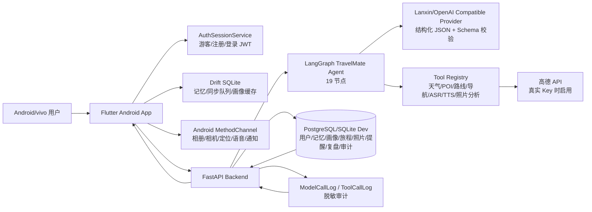
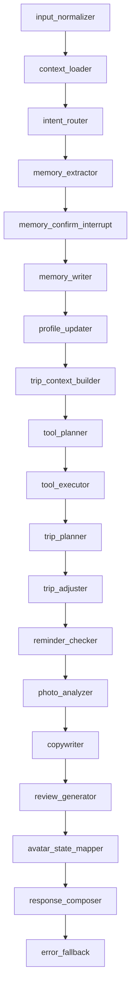

# Demo 证据包：截图、架构图、toolTrace 与风险说明

> 用途：给队友制作 PPT、答辩页和最终提交包时直接取材。本文不替代真实录屏；涉及真机画面、接口截图和真实 Key 结果的部分仍需人工录制/截取。

## 1. 必截画面

| 类型 | 画面 | 验收重点 | 人工状态 |
| --- | --- | --- | --- |
| App | 首页 | 真实联调入口、旅程/记忆/提醒摘要、小屏无遮挡 | 需真机或模拟器截图 |
| App | 聊天页 | 用户自然语言需求、蓝小心回复、记忆候选、语音入口 | 需真机或模拟器截图 |
| App | 记忆页 | 长期/本次/临时记忆，敏感/个人信息显式确认 | 需真实用户数据截图 |
| App | 规划页 | 任意目的地表单、画像匹配、外部数据状态、重规划入口 | 需真实 Key 或明确 fallback 截图 |
| App | 提醒页 | 自动评估提醒、冷却、通知投递状态 | 需 Android/vivo 权限截图 |
| App | 旅拍页 | 相册/相机入口、候选照片、盲盒任务、文案生成 | 需真实照片素材截图 |
| App | 复盘页 | 路线、照片、任务、提醒、状态变化、下次建议 | 需真实旅程上下文截图 |
| API | `/docs` | Swagger 可打开，路由分组清晰 | 需浏览器截图 |
| API | `/api/agent/chat` | camelCase 响应、`memoryCandidates`、`toolTrace` | 需接口工具截图 |
| API | `/api/audit/model-calls` | 脱敏、fallback 原因、scenario/provider | 需真实或 smoke 结果截图 |
| API | `/api/audit/tool-calls` | weather/poi/route provider、fallback/cache/retry | 需真实或 smoke 结果截图 |

## 2. 系统架构图



## 3. Agent 主链路图



## 4. toolTrace 示例

真实 Key 可用时，答辩页建议展示 `fallback=false`；无 Key 演示时必须明确标注为 `fallback/unconfigured` 降级，不得伪装成真实数据。

```json
[
  {
    "tool": "weather_tool",
    "provider": "amap",
    "fallback": false,
    "cacheHit": false,
    "retryCount": 0,
    "city": "重庆",
    "condition": "多云",
    "temperature": "27",
    "sourceTime": "2026-06-21T10:30:00+08:00"
  },
  {
    "tool": "poi_tool",
    "provider": "amap",
    "fallback": false,
    "cacheHit": true,
    "keyword": "夜景",
    "items": [
      {
        "name": "洪崖洞民俗风貌区",
        "location": "106.579,29.562",
        "businessHours": "09:00-23:00"
      }
    ]
  },
  {
    "tool": "route_tool",
    "provider": "amap",
    "fallback": false,
    "mode": "walking",
    "durationMinutes": 18,
    "distanceMeters": 1260,
    "alternatives": []
  }
]
```

无 Key 或服务异常时，示例应展示：

```json
{
  "tool": "route_tool",
  "provider": "unconfigured",
  "fallback": true,
  "fallbackReason": "LANXIN_AMAP_API_KEY is not configured",
  "errorType": "unconfigured",
  "retryCount": 0,
  "cacheHit": false,
  "circuitOpen": false
}
```

## 5. 风险说明页

| 风险 | 当前处理 | 仍需人工 |
| --- | --- | --- |
| 真实模型未配置 | Provider 接口、schema 校验、审计日志和 fallback 已完成 | 配置蓝心/OpenAI 兼容密钥并验收效果 |
| 地图天气 Key 未配置 | 高德 Provider、缓存、重试、熔断、限流和可视化已完成 | 配置高德 Key，确认计费与展示授权 |
| 真机权限差异 | Android MethodChannel 已接入，拒绝/不可用提示已细化 | vivo/Android 真机验证相册、相机、定位、麦克风、通知、TTS |
| 隐私与合规 | 数据导出/清空/撤销、脱敏审计、敏感记忆显式确认已完成 | 最终公开隐私文案和素材授权确认 |
| 社交发布边界 | 旅拍文案和复盘内容只做辅助生成，发布前必须由用户确认 | 公开 Demo 前确认视频中没有自动发布暗示 |
| APK 发布 | CI 配置 SDK 35，Android-only 规则已落地 | 本机安装 SDK 35 或 CI 构建 APK，确认包名、签名、版本号 |
| 比赛提交材料 | Demo 脚本、验收清单、本文证据包已准备 | 团队信息、PPT、视频、平台上传和最终审稿 |

## 6. PPT 页建议

1. 问题与目标：旅行前中后信息割裂，蓝心同行做持续陪伴。
2. 产品闭环：聊天需求、记忆确认、规划、提醒、旅拍、复盘。
3. 技术架构：使用本文系统架构图。
4. Agent 设计：使用 19 节点主链路图和结构化 schema 校验说明。
5. 真实数据链路：模型、地图天气、设备能力、Postgres/Drift 同步。
6. 安全可信：隐私确认、审计、fallback 透明化。
7. Demo 画面：放 5 到 7 张真机截图。
8. 风险与下一步：使用本文风险说明页。
